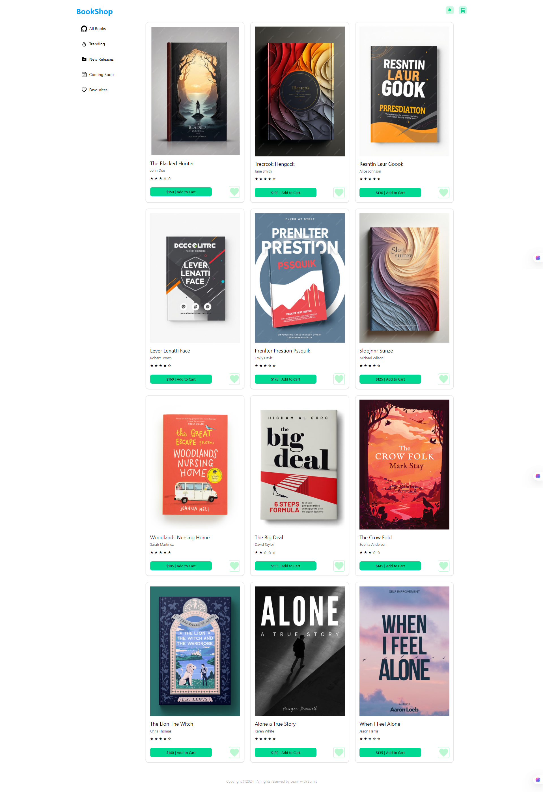
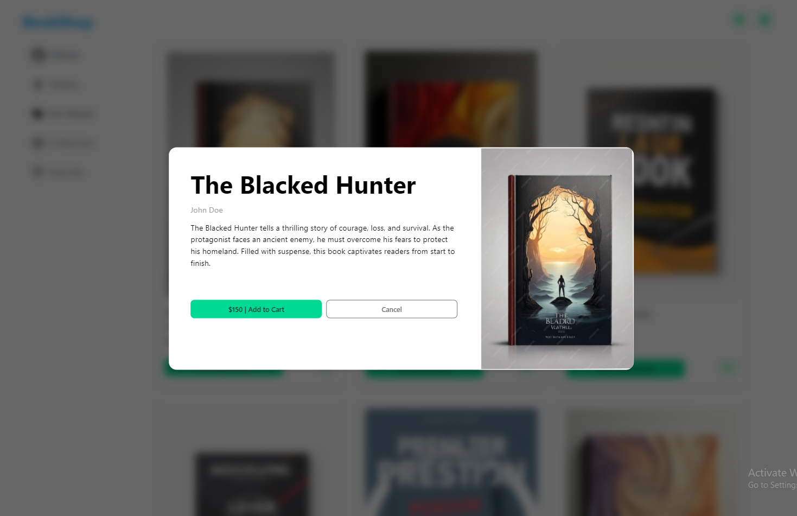
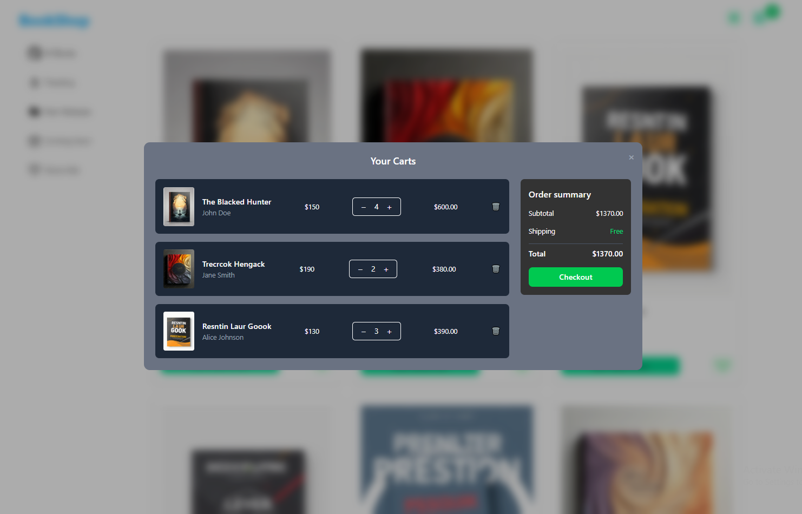

# 📚 Book Shop

**Book Shop** is a modern and interactive online bookstore built with **React**, **Vite**, and **Tailwind CSS**.  
Users can browse books, add them to the cart, mark them as favorites, view detailed information in a modal, and manage their order summary.  
The project demonstrates React basics such as **useState**, **props handling**, and **dynamic rendering**.

---

## 🌐 Live Demo
🔗 **[Live Project Link](YOUR_LIVE_PROJECT_LINK_HERE)**

---

## 📸 Screenshots





---

## ✨ Features

- 📖 **All Books View** — Display all available books
- 🔥 **Trending Books** — View popular books
- 🆕 **New Releases** — View newly released books
- ⏳ **Coming Soon** — View upcoming books
- ❤️ **Favorites** — Save favorite books
- 🛒 **Add to Cart** — Add books to the cart
- ➕➖ **Quantity Control** — Increase or decrease quantity in the order summary
- ℹ **Product Modal** — View detailed information about each book
- 🎯 **Sorting System** — Filter books by category

---

## 🛠 Technologies Used

- **React.js** — For building the UI and managing components
- **Vite** — For fast development and build process
- **Tailwind CSS** — For responsive and modern styling
- **JavaScript (ES6+)** — For implementing logic
- **Props & State Management** — For data handling between components

---

## 🚀 Installation & Setup

Follow these steps to run the project locally:

1️⃣ **Clone the repository**
```bash
git clone https://github.com/ziaul-hoque4820/Book-Shop.git
```

2️⃣ **Navigate to the project folder**
```bash
cd Book-Shop
```
3️⃣ **Install dependencies**
```bash
npm install
```
4️⃣ **Start the development server**
```bash
npm run dev
```
5️⃣ **Open in your browser**
```bash
http://localhost:5173
```
---
### 🤝 Contributing
If you’d like to contribute:
- Fork the repository
- Create a new branch
- Make your changes
- Submit a Pull Request

### 📜 License
This project is licensed under the MIT License.
You are free to use it for personal or commercial purposes.

## 👨‍💻 Author

**Ziaul Hoque Patwary**  
📧 Email: [**ziaul.dev@gmail.com**] 
🔗 GitHub: [ziaul-hoque4820](https://github.com/ziaul-hoque4820)

---

**Thanks for visiting the project! Feel free to star ⭐ the repo or contribute.**